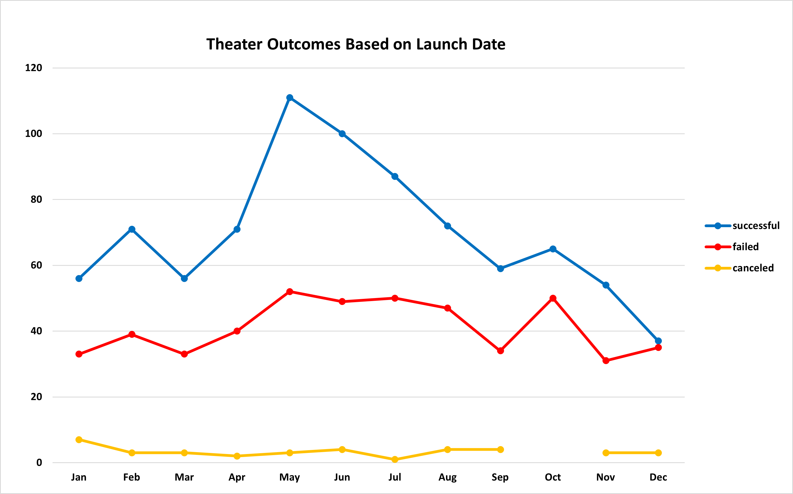
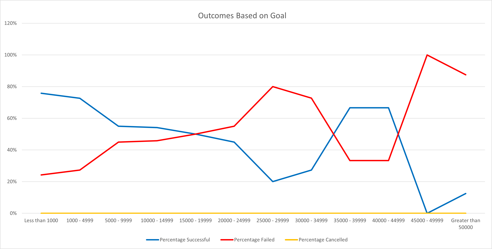

# Kickstarter Analysis

## Project Overview

This project aims to find out how the different Kickstarter campaigns fared in relation to both their launch dates and the goals that were set for the campaign.

## Analysis and Challenges

This Section discusses the outcomes of the analysis carried out based on the date the fundraising was launched and the goals that were set for each of the fundraising events.
The Launch date was filtered on the Parent category "theater" while the outcome based on goals was filtered on the subcategory "plays".

### Analysis of the outcome based on the Launch Date

The parent category theater has subcategories which include:
* plays

* musicals

* spaces

There were 1369 theater fundraising campaigns out of which 839 were successful, 493 campaigns failed and 37 of them got canceled. Below is an image that shows the theater outcomes based on the launch dates.

   

From the image, the following observations can be made:
* A lot of successful campaigns started in the months of May and June.
* October was a bad month to start a campaign even though the amount of successful campaigns was higher than the failed campaigns.
* Most campaigns are launched between the months of May and July

### Analysis of the outcome based on the Goal

This was just based on the the subcategory plays and and below is the diagram of the analysis.

 

The following observations can be made from the image above:
* Campaigns that a goal of $45,000 and above failed
* More than 75% of the campaigns that were $5,000 or less were successful

## Results

An overview of the analysis results.
* A lot of successful theater campaigns started in the months of May and June.
* October was a bad month to start a theater campaign even though the amount of successful campaigns was higher than the failed campaigns.
* More than 75% of the campaigns that were $5,000 or less were successful

### Limitations:
* I believe that both the launch dates and the goals should have been combined to give a more accurate result 
